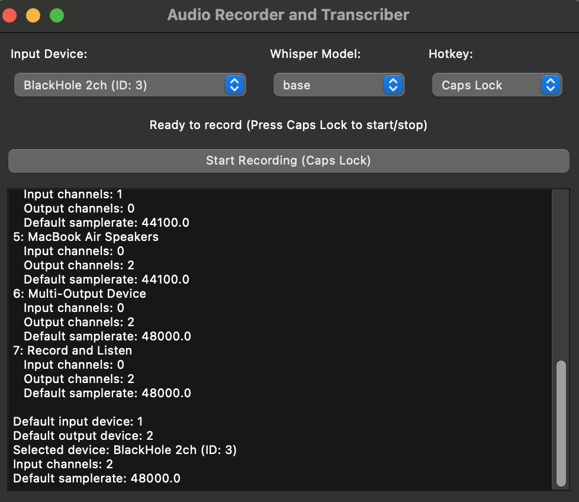

# Audio Recorder and Transcriber

## Overview

The **Voica** is a desktop application that allows you to record system audio and transcribe it into text, copying the transcription directly to your clipboard. It leverages OpenAI's Whisper model for transcription and is ideal for scenarios like tech interviews, meetings, lectures, or any situation where you need to quickly capture spoken content.



## Features

- **Record System Audio**: Capture audio from your system's output device.
- **Transcribe Audio**: Convert recorded audio into text using OpenAI's Whisper model.
- **Clipboard Integration**: Automatically copy the transcription to your clipboard for quick access.
- **Custom Hotkeys**: Start and stop recording using customizable keyboard shortcuts.
- **Model Selection**: Choose from different Whisper models (`tiny`, `base`, `small`, `medium`, `large`) based on your accuracy and performance needs.
- **User-Friendly Interface**: Simple and intuitive GUI built with PyQt6.
- **Local Processing**: All transcription is done locally, ensuring your audio data remains private.

## Table of Contents

- [Installation](#installation)
  - [Prerequisites](#prerequisites)
  - [Setup Instructions](#setup-instructions)
- [Usage](#usage)
  - [Running the Application](#running-the-application)
  - [Configuring Audio Devices](#configuring-audio-devices)
  - [Recording and Transcribing](#recording-and-transcribing)
- [Configuration](#configuration)
  - [Hotkey Customization](#hotkey-customization)
  - [Model Selection](#model-selection)
- [Troubleshooting](#troubleshooting)
- [Contributing](#contributing)
- [License](#license)
- [Acknowledgements](#acknowledgements)

## Installation

### Prerequisites

- **macOS**: 14.5 or higher
- **Python**: 3.12 or higher
- **Poetry**: for dependency management
- **Homebrew**: for installing BlackHole

### Setup Instructions

1. **Clone the Repository**

   ```bash
   git clone https://github.com/yourusername/audio-recorder-transcriber.git
   cd audio-recorder-transcriber
   ```

2. **Install Python Dependencies**

   We recommend using [Poetry](https://python-poetry.org/) for dependency management.

   - **Install Poetry** (if not already installed):

     ```bash
     curl -sSL https://install.python-poetry.org | python3 -
     ```

   - **Install Dependencies**:

     ```bash
     poetry install
     ```

   Alternatively, you can use `pip` and `requirements.txt`:

   ```bash
   pip install -r requirements.txt
   ```

3. **Install BlackHole for macOS**

   BlackHole is a virtual audio driver that allows you to route audio between applications.

   - **Install via Homebrew**:

     ```bash
     brew install blackhole-2ch
     ```

   - **Set Up Multi-Output Device**:

     - Open **Audio MIDI Setup** (found in `/Applications/Utilities/`).
     - Click the `+` button at the bottom left and select **Create Multi-Output Device**.
     - Check both your main output device (e.g., internal speakers) and **BlackHole 2ch**.
     - Right-click the new multi-output device, select **Use This Device For Sound Output**.

4. **Configure System Input**

   - Open **System Preferences** > **Sound** > **Input**.
   - Select **BlackHole 2ch** as your input device.

## Usage

### Running the Application

Activate your virtual environment (if using Poetry):

```bash
poetry shell
```

Run the application:

```bash
poetry run start
```

### Configuring Audio Devices

1. **Select Input Device**:

   - In the app, choose **BlackHole 2ch** from the input device dropdown.

2. **Select Whisper Model**:

   - Choose the desired Whisper model based on your needs:
     - `tiny`: Fastest, less accurate.
     - `base`: Balanced speed and accuracy.
     - `small`, `medium`, `large`: Increasingly accurate but require more resources.

### Recording and Transcribing

1. **Set Hotkey**:

   - Choose a hotkey from the dropdown to start/stop recording (default is `Caps Lock`).

2. **Start Recording**:

   - Press the selected hotkey or click the **Start Recording** button.
   - The status label will display **Recording...**.

3. **Stop Recording**:

   - Press the hotkey again or click the **Stop Recording** button.
   - Transcription will begin automatically.

4. **Access Transcription**:

   - Once transcription is complete, the text will be displayed in the log area.
   - The transcription is automatically copied to your clipboard.

## Configuration

### Hotkey Customization

- **Change Hotkey**:

  - Select your preferred hotkey from the **Select Hotkey** dropdown.
  - Supported hotkeys: `Caps Lock`, `F1`, `F2`, `F3`, `F4`, `F5`.

### Model Selection

- **Change Whisper Model**:

  - Select a model from the **Select Whisper Model** dropdown.
  - Models vary in size and accuracy.

## Troubleshooting

- Ensure BlackHole is properly set up as both an output and input device.
- Check that the app has necessary permissions to access the microphone.
- For better accuracy, try a larger Whisper model (may impact performance).
- Make sure the app window is in focus for hotkeys to work.

## Contributing

Contributions are welcome! Please feel free to submit a Pull Request.

## License

This project is licensed under the MIT License - see the [LICENSE](LICENSE) file for details.

## Acknowledgements

- [OpenAI Whisper](https://github.com/openai/whisper) for the speech recognition model
- [BlackHole](https://github.com/ExistentialAudio/BlackHole) for the virtual audio driver
- [PyQt6](https://www.riverbankcomputing.com/software/pyqt/) for the GUI framework

---

**Disclaimer**: This app is provided "as is" without warranty of any kind. Use at your own risk.